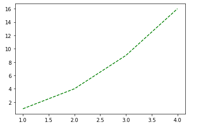
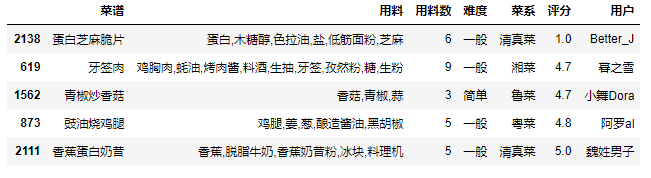
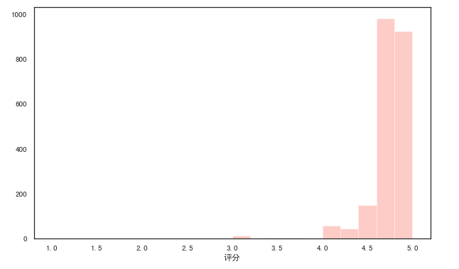
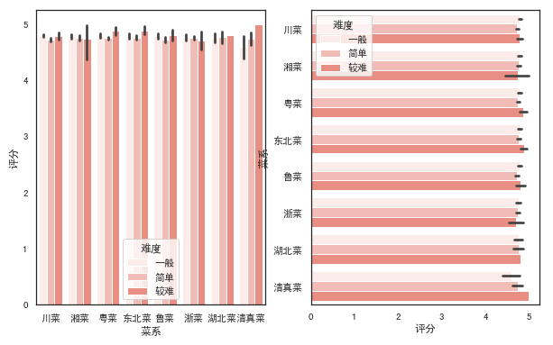
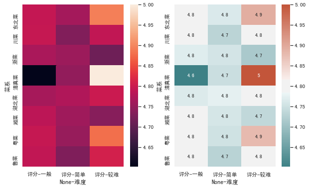

# Matplotlib

- [1. matplotlib 基础](#1-matplotlib-基础)
  - [1.1. plt.plot() 函数](#11-pltplot-函数)
    - [1.1.1. 传入多组数据](#111-传入多组数据)
    - [1.1.2. 线条属性](#112-线条属性)
  - [1.2. 子图](#12-子图)
- [2. Matplotlib 绘图](#2-matplotlib-绘图)
  - [2.1. 数据导入](#21-数据导入)
  - [2.2. 柱状图](#22-柱状图)
  - [2.3. 曲线图](#23-曲线图)
  - [2.4. 饼图](#24-饼图)
  - [2.5. 直方图](#25-直方图)
  - [2.6. 散点图](#26-散点图)
  - [2.7. 箱型图](#27-箱型图)
- [3. Seaborn 绘图](#3-seaborn-绘图)
  - [3.1. Seaborn 简介](#31-seaborn-简介)
  - [3.2. 数据准备](#32-数据准备)
  - [3.3. 导入相关包](#33-导入相关包)
  - [3.4. 直方图](#34-直方图)
  - [3.5. 散点图](#35-散点图)
  - [3.6. 条形图](#36-条形图)
  - [3.7. 折线图](#37-折线图)
  - [3.8. 饼图](#38-饼图)
  - [3.9. 箱图](#39-箱图)
  - [3.10. 小提琴图](#310-小提琴图)
  - [3.11. 回归图](#311-回归图)
  - [3.12. 热力图](#312-热力图)

## 1. matplotlib 基础

Python 的一个 2D 图形包，pyplot 封装很很多画图函数。

```python
import matplotlib.pyplot as plt
import numpy as np
```

matplotlib.pyplot 包含一系列类似类似 MATLAB 中绘图函数的相关函数。

### 1.1. plt.plot() 函数

plt.plot() 函数可以用来绘制线型图

```python
plt.plot([1,2,3,4])   ##默认使用索引作为 x，此处参数指定的是 y
```


```python
plt.plot([1,2,3,4])
plt.ylabel('y')
plt.xlabel('x')
```


plot 函数基本的用法：

1. 指定 x 和 y：plt.plot(x,y)
2. 默认参数，x 为~N-1：plt.plot(y)
因此，在上面的例子中，默认使用了 0，1，2，3 作为 x 值

```python
plt.plot([1,2,3,4],[1,4,9,16])
plt.show()
```


常用标识颜色的字符参数：\
'b'：蓝色 blue\
'g'：绿色 green\
'r'：红色 red\
'c'：青色 cyan\
'm'：品红 magenta\
'y'：黄色 yellow\
'k'：黑色 black\
'w'：白色 white

常用表示类型的字符参数：\
'-'：实线、
'- -'：虚线、
'-.'：虚点线、
':'点线、
'.'：点、
','：像素点、
'o'：圆点、
'v'：下三角点、
'`'：上三角点、
'<'：左三角点、
'>'：右三角点、
'1'：下三叉点、
'2'：上三叉点、
'3'：左三叉点、
'4'：右三叉点、
's'：正方点、
'p'：五角点、
'*'：星型点、
'h'：六边形点 1\
'H'：六边形点 2\
'+'：加号点、
'x'：乘号点、
'D'：实心菱形点、
'd'：瘦菱形点、
'_'：横线点、

```python
plt.plot([1,2,3,4],[1,4,9,16],'g--')
plt.show()
```



可以使用 axis 函数指定坐标轴显示的范围

```python
plt.plot([1,2,3,4],[1,4,9,16],'g--')
plt.axis([0,5,0,20])
plt.show()
```


传入 numpy 数组

如果传入的是列表，matplotlib 会在内部将它转化成数组再进行处理

在一个图里画多条线

```python
t=np.arange(0.,5.,0.2)
plt.plot(t,t,'r--',
         t,t**2,'b-.',
         t,t**3,'g-')
plt.show()
```


#### 1.1.1. 传入多组数据

画多条线是传入了多组（x,y,format_str），我们可以把这些组合放到一个 plot 函数中去即可。\
plt.plot(x1,y1,'format1',x2,y2,'format2',......)

#### 1.1.2. 线条属性

可以通过 linewidth 设置线条粗度，通过 color 设置线条颜色

```python
x=np.linspace(-np.pi,np.pi)
y=np.sin(x)
plt.plot(x,y,linewidth=5,color='r')
plt.show
```


利用 plt.plot 的返回值来这是线条属性

plot 函数返回一个 line2D 对象组成的列表，每个对象代表输入的一对组合，例如：\
    **line1，line2 为两个 Line2D 对象**\
    line1,line2 = plt.plot(x1,y1,x2,y2)\
    **返回 3 个 Line2D 对象组成的列表**\
    lines=plt.plot(x1,y1,x2,y2,x3,y3)\
我们可以使用这个返回值来对线条属性进行设置。

```python
x=np.linspace(-np.pi,np.pi)
y=np.sin(x)
line1,line2=plt.plot(x,y,'r-',x,y+1,'g-')
## 对 plot 返回的一个对象进行属性修改
line1.set_antialiased(False)   ## 抗锯齿功能关闭
plt.show()
```


利用 plt.setp() 修改线条性质

```python
x=np.linspace(-np.pi,np.pi)
y=np.sin(x)
line=plt.plot(x,y)
plt.setp(line,color='r',linewidth=5)
plt.show()
```


### 1.2. 子图

figure() 函数会产生一个指定编号为 num 的图：**plt.figure(num)**\
这里，figure(1) 其实是可以省略的，因为默认情况下，plt 会自动产生一幅图像。\
使用 subplot() 可以在一幅图中生成多个子图，其参数为：**plt.subplot(numrows,numcols,fignum)**\
当 numrows * numcols < 10 时，中间的逗号可以省略，因此 plt.subplot(211) 就相当于 plt.subplot(2,1,1)

```python
def f(t):
    return np.exp(-t)*np.cos(2*np.pi*t)
t1=np.arange(0.,5.,0.1)
t2=np.arange(0.,5.,0.02)

plt.figure(figsize=(10,6))
plt.subplot(211)
plt.plot(t1,f(t1),'bo',t2,f(t2),'k')

plt.subplot(212)
plt.plot(t2,np.cos(2*np.pi*t2),'r--')
plt.show()
```


## 2. Matplotlib 绘图

### 2.1. 数据导入

自定义图形属性

```python
plt.rcParams['font.sans-serif']=['SimHei']  ##设置字体为 黑体
plt.rcParams['axes.unicode_minus']=False ##显示符号
df=pd.read_excel('movies_data3.xlsx') ##导入电影数据
df.head()
```


### 2.2. 柱状图

柱状图 bar chart，是一种以长方形的长度为变量的表达图形统计报告图，由一系列高度不等的纵向条纹表示数据分布的情况，用来比较两个或以上的价值（不同时间或者不同条件），只有一个变量，通常利用于较小的数据集分析。柱状图可横向排列，或用多维方式表达。

绘制每个国家或地区的电影数量的柱状图

```python
data=df['产地'].value_counts()
x=data.index
y=data.values
## 定义图片大小
plt.figure(figsize=(15,6))
## 定义图片标题
plt.title('各国家或地区电影数量',fontsize=20)
## 设置横纵轴的名称
plt.xlabel('国家或地区',fontsize=18)
plt.ylabel('电影数量',fontsize=18)
##调整轴上属性
plt.tick_params(labelsize=14)  ##字体设置 14 号
plt.xticks(rotation=90)  ##X 轴的字体进行 90 度旋转
## 添加网格线
plt.grid()

## 在每个柱形上标注文本
for a,b in zip(x,y):
    plt.text(a,b+10,b,ha='center',va='bottom',fontsize=15,color='r')   
    ##text（横坐标，纵坐标，标注文本，对齐方式，标注位置（在柱形的方位），字体大小，)

## 柱状图绘制
plt.bar(x,y,color='g')
plt.show()
```


### 2.3. 曲线图

```python
data=df['年代'].value_counts()
data=data.sort_index()
data=data[:-2]  ## 按年份排序，把 2016 年和 2017 年剔掉
x=data.index
y=data.values
plt.figure(figsize=[15,6])
plt.plot(x,y,color='b')
plt.title('每年上映的电影数量',fontsize=20)
plt.xlabel('年份',fontsize=18)
plt.ylabel('电影数量',fontsize=18)
plt.tick_params(labelsize=14)

## 设置 x 的间距/步长为 10 的文本显示
for a,b in zip(x[::10],y[::10]):
    plt.text(a,b+10,b,ha='center',va='bottom',fontsize=15)

## 标记特殊点   ## （箭头文本，特殊点位置（箭头位置），文本位置（箭尾位置），箭头属性（填充颜色，边框颜色））
plt.annotate('2012 年达到最大值',xy=(2012,data[2012]),xytext=(2025,2100),arrowprops=dict(facecolor='black',edgecolor='red'))
## 设置文本
plt.text(1980,1000,'电影数量开始快速增长')

plt.show()
```


### 2.4. 饼图

函数原型：\
pie(x, explode=None, labels=None, colors=None, autopct=None, pctdistance=0.6, shadow=False, labeldistance=1.1, startangel=None, radius=None)

**参数：**\
x：（每一块）的比例，如果 sum(x) > 1 会使用 sum(x) 归一化、
labels：（每一块）饼图外侧显示的说明文字、
explode：（每一块）离开中心距离、
startangle：其实绘制角度，默认图是从 x 轴正方向逆时针画起。如设定=90 则从 y 轴正方向画起、
shadow：是否阴影、
labeldistance：label 绘制位置。相对于半径的比例。如<1 则绘制在饼图内侧、
autopct：控制饼图内百分比设置，可以使用 format 字符串或者 format function（'%1.1f'指小数点前后位数（没有用空格补齐））\
pctdistance：类似于 labeldistance。指定 autopct 的位置刻度、
radius：控制饼图半径

**返回值：**\
如果没有设置 autopct，返回 (patches, texts)\
如果设置 autopct，返回（patches, texts, autotexts）

根据电影的时长绘制饼图

```python
data=pd.cut(df['时长'],[0,60,90,110,1000]).value_counts()
y=data.values
## 可有可无，不写的话，系统自动进行归一化
y=y/sum(y)

plt.figure(figsize=(7,7))
plt.title('电影时长占比',fontsize=20)

patches,l_text,p_text = plt.pie(y,labels=data.index,autopct='%.1f %%',colors='bygr',startangle=90)
## 设置返回值——饼图内部字体
for i in p_text:
    i.set_size(15)
    i.set_color('w')
## 设置返回值——外部字体
for i in l_text:
    i.set_size(15)
    i.set_color('r')

## 图例
plt.legend()

plt.show()
```


### 2.5. 直方图

根据电影的评分绘制频率分布直方图

```python
plt.figure(figsize=(10,6))
plt.hist(df['评分'],bins=20,edgecolor='k',alpha=0.5)
plt.show()
```


### 2.6. 散点图

用两组数据构成多个坐标点，考察坐标点的分布，判断两变量之间是否存在某种关联或总结坐标点的分布模式。散点图将序列显示为一组点。值由点在图表中的位置表示。类别由图表中的不同标记表示。散点图通常用于比较跨类别的聚合数据。

根据电影时长和电影评分绘制散点图

```python
x=df['时长']
y=df['评分']

plt.figure(figsize=(10,8))
plt.scatter(x,y)
plt.title('电影时长与评分散点图',fontsize=20)
plt.xlabel('时长',fontsize=18)
plt.ylabel('评分',fontsize=18)
plt.show()
```


### 2.7. 箱型图

```python
data=df[df. 产地=='美国']['评分']
plt.figure(figsize=(10,6))
plt.boxplot(data,whis=2,flierprops={'marker':'o','markerfacecolor':'r','color':'k'},  ##异常点设置
            patch_artist=True,boxprops={'color':'k','facecolor':'#9999ff'})   ##箱体颜色填充
plt.title('美国电影评分箱线图',fontsize=20)
plt.show()
```


## 3. Seaborn 绘图

### 3.1. Seaborn 简介

Seaborn 是一个基于 matplotlib 且数据结构与 pandas 统一的统计图制作库。
Seaborn 框架旨在以数据可视化为中心来挖掘与理解数据。
与 matplotlib 相比，它的代码更简洁，图形也更美观。

pip 命令安装

```python
#pip install matplotlib
#pip install seaborn
```

导入绘图模块

```python
#mport matplotlib.pyplot as plt
#import seaborn as sns
```

提供显示条件

```python
#%matplotlib inline  #在 Jupyter 中正常显示图形
```

导入数据

```python
#Seaborn 内置数据集导入
#dataset = sns.load_dataset('dataset')

#外置数据集导入（以 csv 格式为例）
#dataset = pd.read_csv('dataset') 
```

设置画布

```python
#设置一块大小为 (12,6) 的画布
#plt.figure(figsize=(12, 6))
```

输出图形

```python
#整体图形背景，共 5 种："white", "dark", "whitegrid", "darkgrid", "ticks"
#sns.set_style('ticks')

#以条形图为例输出图形
#sns.barplot(x=x,y=y,data=dataset,...)
'''
barplot() 括号里的是需要设置的具体参数，
涉及到数据、颜色、坐标轴、以及具体图形的一些控制变量，
基本的一些参数包括'x'、'y'、'data'，分别表示 x 轴，y 轴，
以及选择的数据集。
'''
```

保存图形

```python
#将画布保存为保存为 png、jpg、svg 等格式图片
#plt.savefig('jg.png')
```

### 3.2. 数据准备

```python
df = pd.read_csv('./cook.csv') #读取数据集
df['难度'] = df['用料数'].apply(lambda x:'简单' if x<5 else('一般' if x<15 else '较难')) #增加分类字段
df = df[['菜谱','用料','用料数','难度','菜系','评分','用户']] #选择需要的列
df.sample(5)  #查看数据集的随机 5 行数据
```



### 3.3. 导入相关包

```python
import numpy as np
import pandas as pd
import matplotlib.pyplot as plt
import matplotlib as mpl
import seaborn as sns
%matplotlib inline
plt.rcParams['font.sans-serif'] = ['SimHei']  # 设置加载的字体名
plt.rcParams['axes.unicode_minus'] = False   # 解决保存图像是负号'-'显示为方块的问题 
# sns.set_style('white')   #设置图形背景样式为 white
```

### 3.4. 直方图

```python
#语法
'''
seaborn.distplot(a, bins=None, hist=True, kde=True, rug=False, fit=None, 
hist_kws=None, kde_kws=None, rug_kws=None, fit_kws=None, color=None, 
vertical=False, norm_hist=False, axlabel=None, label=None, ax=None)
'''

#distplot() 输出直方图，默认拟合出密度曲线
plt.figure(figsize=(10, 6)) #设置画布大小
rate = df['评分']
sns.distplot(rate,color="salmon",bins=20) #参数 color 样式为 salmon，bins 参数设定数据片段的数量
```


```python
#kde 参数设为 False, 可去掉拟合的密度曲线
plt.figure(figsize=(10, 6))
sns.distplot(rate,kde=False,color="salmon",bins=20)
```



```python
#设置 rug 参数，可添加观测数值的边际毛毯
fig,axes=plt.subplots(1,2,figsize=(10,6)) #为方便对比，创建一个 1 行 2 列的画布，figsize 设置画布大小

sns.distplot(rate,color="salmon",bins=10,ax=axes[0]) #axes[0] 表示第一张图（左图）

sns.distplot(rate,color="green",bins=10,rug=True,ax=axes[1]) #axes[1] 表示第一张图（右图）
```


```python
#多个参数可通过字典传递
fig,axes=plt.subplots(1,2,figsize=(10,6)) 
sns.distplot(rate,color="salmon",bins=20,rug=True,ax=axes[0])

sns.distplot(rate,rug=True,
                     hist_kws={'color':'g','label':'直方图'},
                     kde_kws={'color':'b','label':'密度曲线'},
                     bins=20,
                     ax=axes[1])
```


### 3.5. 散点图

常规散点图：scatterplot

```python
#语法
'''
seaborn.scatterplot(x=None, y=None, hue=None, style=None, size=None, 
data=None, palette=None, hue_order=None, hue_norm=None, sizes=None, 
size_order=None, size_norm=None, markers=True, style_order=None, x_bins=None,
y_bins=None, units=None, estimator=None, ci=95, n_boot=1000, alpha='auto', 
x_jitter=None, y_jitter=None, legend='brief', ax=None, **kwargs)
'''

fig,axes=plt.subplots(1,2,figsize=(10,6)) 
#hue 参数，对数据进行细分
sns.scatterplot(x="用料数", y="评分",hue="难度",data=df,ax=axes[0])

#style 参数通过不同的颜色和标记显示分组变量
sns.scatterplot(x="用料数", y="评分",hue="难度",style='难度',data=df,ax=axes[1])
```


分簇散点图：stripplot

```python
#语法
'''
seaborn.stripplot(x=None, y=None, hue=None, data=None, order=None, 
hue_order=None, jitter=True, dodge=False, orient=None, color=None, 
palette=None, size=5, edgecolor='gray', linewidth=0, ax=None, **kwargs)
'''

#设置 jitter 参数控制抖动的大小
plt.figure(figsize=(10, 6))
sns.stripplot(x="菜系", y="评分",hue="难度",jitter=1,data=df)
```


分类散点图：swarmplot

```python
#绘制分类散点图（带分布属性）
#语法
'''
seaborn.swarmplot(x=None, y=None, hue=None, data=None, order=None,
hue_order=None, dodge=False, orient=None, color=None, palette=None, 
size=5, edgecolor='gray', linewidth=0, ax=None, **kwargs)
'''

plt.figure(figsize=(10, 6))
sns.swarmplot(x="菜系", y="评分",hue="难度",data=df)
```


### 3.6. 条形图

常规条形图：barplot

```python
#语法
'''
seaborn.barplot(x=None, y=None, hue=None, data=None, order=None, 
hue_order=None,ci=95, n_boot=1000, units=None, orient=None, color=None,
palette=None, saturation=0.75, errcolor='.26', errwidth=None, capsize=None, 
ax=None, estimator=<function mean>，**kwargs)
'''

#barplot() 默认展示的是某种变量分布的平均值（可通过修改 estimator 参数为 max、min、median 等）
# from numpy import median
fig,axes=plt.subplots(1,2,figsize=(10,6)) 
sns.barplot(x='菜系',y='评分',color="r",data=df,ax=axes[0])

sns.barplot(x='菜系',y='评分',color="salmon",data=df,estimator=min,ax=axes[1])
```

```python
fig,axes=plt.subplots(1,2,figsize=(10,6))
#设置 hue 参数，对 x 轴的数据进行细分
sns.barplot(x='菜系',y='评分',color="salmon",hue='难度',data=df,ax=axes[0])
#调换 x 和 y 的顺序，可将纵向条形图转为水平条形图
sns.barplot(x='评分',y='菜系',color="salmon",hue='难度',data=df,ax=axes[1])
```


计数条形图：countplot

```python
#语法
'''
seaborn.countplot(x=None, y=None, hue=None, data=None, order=None, 
hue_order=None, orient=None, color=None, palette=None, saturation=0.75, dodge=True, ax=None, **kwargs)
'''

fig,axes=plt.subplots(1,2,figsize=(10,6))
#选定某个字段，countplot() 会自动统计该字段下各类别的数目
sns.countplot(x='菜系',color="salmon",data=df,ax=axes[0])
#同样可以加入 hue 参数
sns.countplot(x='菜系',color="salmon",hue='难度',data=df,ax=axes[1])
```



### 3.7. 折线图

```python
#语法
'''
seaborn.lineplot(x=None, y=None, hue=None, size=None, style=None, 
data=None, palette=None, hue_order=None, hue_norm=None, sizes=None, size_order=None,
size_norm=None, dashes=True, markers=None, style_order=None, units=None, estimator='mean',
ci=95, n_boot=1000, sort=True, err_style='band', err_kws=None, legend='brief', ax=None, **kwargs)
'''

fig,axes=plt.subplots(1,2,figsize=(10,6)) 
#默认折线图有聚合
sns.lineplot(x="用料数", y="评分", hue="菜系",data=df,ax=axes[0]) 

#estimator 参数设置为 None 可取消聚合
sns.lineplot(x="用料数", y="评分", hue="菜系",estimator=None,data=df,ax=axes[1]) 
```


### 3.8. 饼图

常规饼图

```python
#语法
'''
pie(x,labels=None,explode=None,colors=None, autopct=None,
pctdistance=0.6, shadow=False, labeldistance=1.1, startangle=None,
radius=None, counterclock=True, wedgeprops=None, textprops=None,
center=(0, 0), frame=False, rotatelabels=False, hold=None, data=None)
'''

plt.figure(figsize=(10, 6))
sorted_counts = df['菜系'].value_counts()
plt.pie(x = sorted_counts, labels = sorted_counts.index, startangle = 90,
        counterclock = False) #startangle=90 和 counterclock = False 表示在垂直上方开始第一个扇区，然后按照顺时针方向有序地绘制每个扇区
plt.axis('square')   #axis 函数将生成标准饼图
```


环形图

```python
plt.figure(figsize=(10, 6))
plt.pie(sorted_counts, labels = sorted_counts.index, startangle = 90,
        counterclock = False, wedgeprops = {'width' : 0.4}) #wedgeprops 可设置环形宽度
plt.axis('square')
```


### 3.9. 箱图

箱线图：boxplot

```python
#语法
'''
seaborn.boxplot(x=None, y=None, hue=None, data=None, order=None, 
hue_order=None, orient=None, color=None, palette=None, saturation=0.75, 
width=0.8, dodge=True, fliersize=5, linewidth=None, whis=1.5, notch=False, ax=None, **kwargs)
'''
fig,axes=plt.subplots(1,2,figsize=(10,6)) 
sns.boxplot(x='菜系',y='评分',hue='难度',data=df,ax=axes[0])

#调节 order 和 hue_order 参数，可以控制 x 轴展示的顺序，linewidth 调节线宽
sns.boxplot(x='菜系',y='评分',hue='难度',data=df,color="salmon",linewidth=1,
                    order=['清真菜','粤菜','东北菜','鲁菜','浙菜','湖北菜','川菜'],
                    hue_order=['简单','一般','较难'],ax=axes[1])

```


箱型图：boxenplot

```python
#语法
'''
seaborn.boxenplot(x=None, y=None, hue=None, data=None, order=None,
hue_order=None, orient=None, color=None, palette=None, saturation=0.75,
width=0.8, dodge=True, k_depth='proportion', linewidth=None, scale='exponential',
outlier_prop=None, ax=None, **kwargs)
'''

fig,axes=plt.subplots(1,2,figsize=(10,6)) 
sns.boxenplot(x='菜系',y='评分',hue='难度',data=df,color="salmon",ax=axes[0])

#palette 参数可设置调色板
sns.boxenplot(x='菜系',y='评分',hue='难度',data=df, palette="Set2",ax=axes[1])
```


### 3.10. 小提琴图

```python
#语法
'''
seaborn.violinplot(x=None, y=None, hue=None, data=None, order=None, 
hue_order=None, bw='scott', cut=2, scale='area', scale_hue=True, 
gridsize=100, width=0.8, inner='box', split=False, dodge=True, orient=None,
linewidth=None, color=None, palette=None, saturation=0.75, ax=None, **kwargs)
'''

fig,axes=plt.subplots(1,2,figsize=(10,6)) 
sns.violinplot(x='菜系',y='评分',data=df, color="salmon",linewidth=1,ax=axes[0])

#inner 参数可在小提琴内部添加图形，palette 设置颜色渐变
sns.violinplot(x='菜系',y='评分',data=df,palette=sns.color_palette('Greens'),inner='stick',ax=axes[1])
```


### 3.11. 回归图

regplot

```python
'''
seaborn.regplot(x, y, data=None, x_estimator=None, x_bins=None, x_ci='ci',
                scatter=True, fit_reg=True, ci=95, n_boot=1000, units=None, 
                order=1, logistic=False, lowess=False, robust=False, logx=False, 
                x_partial=None, y_partial=None, truncate=False, dropna=True, 
                x_jitter=None, y_jitter=None, label=None, color=None, marker='o',
                scatter_kws=None, line_kws=None, ax=None)
'''

fig,axes=plt.subplots(1,2,figsize=(10,6)) 
#marker 参数可设置数据点的形状
sns.regplot(x='用料数',y='评分',data=df,color='r',marker='+',ax=axes[0])
#ci 参数设置为 None 可去除直线附近阴影（置信区间）
sns.regplot(x='用料数',y='评分',data=df,ci=None,color='g',marker='*',ax=axes[1])
```


lmplot

```python
#语法
'''
seaborn.lmplot(x, y, data, hue=None, col=None, row=None, palette=None, 
               col_wrap=None, height=5, aspect=1, markers='o', sharex=True,
               sharey=True, hue_order=None, col_order=None, row_order=None, 
               legend=True, legend_out=True, x_estimator=None, x_bins=None,
               x_ci='ci', scatter=True, fit_reg=True, ci=95, n_boot=1000, 
               units=None, order=1, logistic=False, lowess=False, robust=False,
               logx=False, x_partial=None, y_partial=None, truncate=False, 
               x_jitter=None, y_jitter=None, scatter_kws=None, line_kws=None, size=None)
'''

#lmplot() 可以设置 hue, 进行多个类别的显示，而 regplot() 是不支持的
sns.lmplot(x='用料数',y='评分',hue='难度',data=df,
           palette=sns.color_palette('Reds'),ci=None,markers=['*','o','+'])

```


### 3.12. 热力图

```python
#语法
'''
seaborn.heatmap(data, vmin=None, vmax=None, cmap=None, center=None, 
                robust=False, annot=None, fmt='.2g', annot_kws=None,
                linewidths=0, linecolor='white', cbar=True, cbar_kws=None, 
                cbar_ax=None, square=False, xticklabels='auto', 
                yticklabels='auto', mask=None, ax=None, **kwargs)
'''

fig,axes=plt.subplots(1,2,figsize=(10,6)) 
h=pd.pivot_table(df,index=['菜系'],columns=['难度'],values=['评分'],aggfunc=np.mean)
sns.heatmap(h,ax=axes[0])

#annot 参数设置为 True 可显示数字，cmap 参数可设置热力图调色板
cmap = sns.diverging_palette(200,20,sep=20,as_cmap=True)
sns.heatmap(h,annot=True,cmap=cmap,ax=axes[1])
#保存图形
plt.savefig('jg.png')
```


