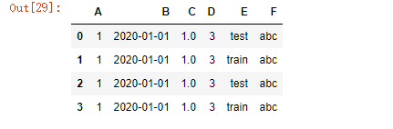
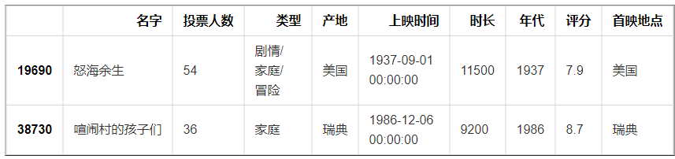
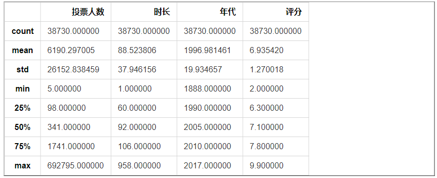

# Pandas学习笔记

- [1. Pandas基本介绍](#1-pandas基本介绍)
  - [1.1. Pandas的基本数据结构](#11-pandas的基本数据结构)
    - [1.1.1. Pandas库的Series类型](#111-pandas库的series类型)
    - [1.1.2. Pandas库的DataFrame类型](#112-pandas库的dataframe类型)
  - [1.2. Pandas读取数据及数据操作](#12-pandas读取数据及数据操作)
  - [1.3. 数据清洗](#13-数据清洗)
  - [1.4. 数据保存](#14-数据保存)
- [2. Pandas操作](#2-pandas操作)
  - [2.1. 数据格式转换](#21-数据格式转换)
  - [2.2. 排序](#22-排序)
  - [2.3. 基本统计分析](#23-基本统计分析)
    - [2.3.1. 描述性统计](#231-描述性统计)
    - [2.3.2. 最值](#232-最值)
    - [2.3.3. 均值和中值](#233-均值和中值)
    - [2.3.4. 方差和标准差](#234-方差和标准差)
    - [2.3.5. 求和](#235-求和)
    - [2.3.6. 相关系数、协方差](#236-相关系数协方差)
  - [2.4. 计数](#24-计数)
    - [2.4.1. 数据替换](#241-数据替换)
  - [2.5. 数据透视](#25-数据透视)
    - [2.5.1. 基础形式](#251-基础形式)
    - [2.5.2. 多个索引  index=['','']](#252-多个索引--index)
    - [2.5.3. 指定需要统计汇总的数据  values](#253-指定需要统计汇总的数据--values)
    - [2.5.4. 指定函数  aggfunc](#254-指定函数--aggfunc)
    - [2.5.5. 非数值处理 fill_value](#255-非数值处理-fill_value)
    - [2.5.6. 计算总合数据 margins=True](#256-计算总合数据-marginstrue)
    - [2.5.7. 对不同值执行不同函数](#257-对不同值执行不同函数)
    - [2.5.8. 透视表过滤](#258-透视表过滤)
    - [2.5.9. 按照多个索引来进行汇总](#259-按照多个索引来进行汇总)
- [3. pandas进阶](#3-pandas进阶)
  - [3.1. 数据重塑和轴向旋转](#31-数据重塑和轴向旋转)
    - [3.1.1. 层次化索引](#311-层次化索引)
    - [3.1.2. DataFrame的层次化索引](#312-dataframe的层次化索引)
  - [3.2. 层次化——电影数据示列](#32-层次化电影数据示列)
    - [3.2.1. 数据旋转](#321-数据旋转)
  - [3.3. 数据分组、分组运算](#33-数据分组分组运算)
  - [3.4. 离散化处理](#34-离散化处理)
  - [3.5. 合并数据集](#35-合并数据集)
    - [3.5.1. append](#351-append)
    - [3.5.2. merge](#352-merge)
    - [3.5.3. concat](#353-concat)

## 1. Pandas基本介绍

Python Data Analysis Library或pandas是基于Numpy的一种工具，该工具是为了解决数据分析任务而创建的。Pandas纳入了大量库和一些标准的数据模型，提供了高效地操作大型数据集所需要的工具。pandas提供了大量能使我们快速便捷的处理数据的函数和方法。

```python
import pandas as pd
import numpy as np
```

### 1.1. Pandas的基本数据结构

pandas中有两种常用的基本结构

•Series
    一维数组，与Numpy中的一维array类似，二者与Python基本的数据结构List也很相似。Series能保存不同种数据类型，字符串、boolean值、数字等都能保存在Series种。

•DataFrame
二维的表格型数据结构，很多功能与R种的data.frame类似。可以将DataFrame理解为Series的容器。

#### 1.1.1. Pandas库的Series类型

一维Series可以用一维列表初始化

```python
a=pd.Series([1,3,5,np.nan,6,5])
print(a)
```

   0    1.0
    1    3.0
    2    5.0
    3    NaN
    4    6.0
    5    5.0
    dtype: float64
默认的情况下，Series的下标都是数字（可以使用额外参数指定），类型是统一的。

```python
b=pd.Series([1,3,5,np.nan,6,5],index=['a','b','c','d','e','f'])
print(b)
```

   a    1.0
    b    3.0
    c    5.0
    d    NaN
    e    6.0
    f    5.0
    dtype: float64

索引——数据行标签

```python
a.index
```

   RangeIndex(start=0, stop=6, step=1)

```python
b.index
```

   Index(['a', 'b', 'c', 'd', 'e', 'f'], dtype='object')

取值

```python
a.values
```

  array([ 1.,  3.,  5., nan,  6.,  5.])

```python
a[0]
```

   1.0

切片

```python
a[2:5]
```

   2    5.0
    3    NaN
    4    6.0
    dtype: float64

```python
b['b':'f':2]
```

   b    3.0
    d    NaN
    f    5.0
    dtype: float64
索引赋值

```python
a.index.name='索引'
a
```

   索引
    0    1.0
    1    3.0
    2    5.0
    3    NaN
    4    6.0
    5    5.0
    dtype: float64

```python
a.index=list('abcdef')
a
```

  a    1.0
    b    3.0
    c    5.0
    d    NaN
    e    6.0
    f    5.0
    dtype: float64

#### 1.1.2. Pandas库的DataFrame类型

DataFrame初始化

DataFrame是个二维结构，这里首先构造一组时间序列，作为第一维的下标

```python
date=pd.date_range('20200101',periods=6)
print(date)
```

   DatetimeIndex(['2020-01-01', '2020-01-02', '2020-01-03', '2020-01-04',
                   '2020-01-05', '2020-01-06'],
                  dtype='datetime64[ns]', freq='D')
然后创建一个DataFream结构

```python
df=pd.DataFrame(np.random.randn(6,4))
df    ##默认使用0、1、2.。。作为索引index
```


```python
df=pd.DataFrame(np.random.randn(6,4),index=date,columns=list('ABCD'))
df    ##index参数设置行索引，columns参数设置列索引
```


除了向DataFrame中传入二维数组，我们也可以使用字典传入数据

```python
df1=pd.DataFrame({'A':1,'B':pd.Timestamp('20200101'),'C':pd.Series(1,index=list(range(4)),dtype=float),'D':np.array([3]*4,dtype=int),'E':pd.Categorical(['test','train','test','train']),'F':'abc'})
df1
```


字典的每个key代表一列，其value可以是各种能够转化为Series的对象
与Series要求所有的类型都一致不同，DataFrame只要求每一列数据的格式相同

```python
df1.dtypes
```

   A             int64
    B    datetime64[ns]
    C           float64
    D             int32
    E          category
    F            object
    dtype: object

DataFrame查看数据

头尾数据
head和tail方法可以分别查看最前面几行和最后面几行的数据（默认为5）

```python
df.head()
df.tail(3)
```

下标、列标、数据

下标使用index属性查看

```python
df.index
```

   DatetimeIndex(['2020-01-01', '2020-01-02', '2020-01-03', '2020-01-04',
                   '2020-01-05', '2020-01-06'],
                  dtype='datetime64[ns]', freq='D')

列标使用columns属性查看

```python
df.columns
```

   Index(['A', 'B', 'C', 'D'], dtype='object')

数据值使用values查看

```python
df.values
```

   array([[ 0.44397794, -0.56828038,  0.53942245, -1.8088147 ],
           [-0.94194603,  1.60065473, -0.16541752, -0.14333282],
           [ 0.05818642,  1.2996908 , -0.72258188, -0.25816996],
           [ 0.91244089, -1.34726583, -0.82709665, -1.18962492],
           [ 0.42712501,  0.01041125, -0.39041139,  1.17227685],
           [-0.58428589, -0.42811927,  0.53630517,  1.32747977]])

### 1.2. Pandas读取数据及数据操作

我们以豆瓣的电影数据作为我们深入了解Pandas的示例

```python
df_mv=pd.read_excel(r'E:\data\豆瓣电影数据.xlsx')
df_mv.head()
```


行操作

```python
df_mv.iloc[0]
```

  Unnamed: 0                      0
    名字                         肖申克的救赎
    投票人数                       692795
    类型                          剧情/犯罪
    产地                             美国
    上映时间          1994-09-10 00:00:00
    时长                            142
    年代                           1994
    评分                            9.6
    首映地点                       多伦多电影节
    Name: 0, dtype: object

也可以使用 loc

```python
df_mv.loc[0:5]
```

添加一行

```python
dit={'名字':'复仇者联盟3',
     '投票人数':123456,
     '类型':'剧情/科幻',
     '产地':'美国',
     '上映时间':'2017-05-04 00:00:00',
     '时长':142,
     '年代':2017,
     '评分':8.7,
     '首映地点':'美国'}
s=pd.Series(dit)
s.name=38738
df_mv=df_mv.append(s)
df_mv.tail()
```

删除一行

```python
df_mv=df_mv.drop([38738])
df_mv.tail()
```

列操作

```python
df_mv.columns
```

   Index(['Unnamed: 0', '名字', '投票人数', '类型', '产地', '上映时间', '时长', '年代', '评分',
           '首映地点'],
          dtype='object')

```python
df_mv['名字'][0:5]
```

   0    肖申克的救赎
    1      控方证人
    2      美丽人生
    3      阿甘正传
    4      霸王别姬
    Name: 名字, dtype: object

```python
df_mv[['名字','类型']][:5]
```

增加一列

```python
df_mv['序号']=range(1,len(df_mv)+1)
df_mv.head()
```

删除一列

```python
df_mv=df_mv.drop('序号',axis=1)
df_mv.head()
```

通过标签选择数据

df.loc[[index],[column]]通过标签选择数据

```python
df_mv.loc[[1,3,4],['名字','评分']]
```

条件选择

选取产地为美国的所有电音

```python
df_mv[df_mv['产地']=='中国大陆'][:5]
```

选取产地为美国，且评分大于9的电影

```python
df_mv[(df_mv.产地=='美国')&(df_mv.评分>9)].head()
```

选取产地为美国或中国大陆，且评分大于9的电影

```python
df_mv[((df_mv.产地=='美国')|(df_mv.产地=='中国大陆'))&(df_mv.评分>9)].head()
```

### 1.3. 数据清洗

缺失值处理

dropna：根据标签中的缺失值进行过滤，删除缺失值
fillna：对缺失值进行填充
isnull：返回一个布尔值对象，判断哪些值是缺失值
notnull：isnull的否定式

判断缺失值

```python
df_mv[df_mv['名字'].isnull()].head()
```

填充缺失值

```python
#填充字符类
df_mv['名字'].fillna('未知电影',inplace=True)
df_mv[df_mv['名字'].isnull()].head()
#填充数值类
dit={'名字':'复仇者联盟3',
     '投票人数':123456,
     '类型':'剧情/科幻',
     '产地':'美国',
     '上映时间':'2017-05-04 00:00:00',
     '时长':142,
     '年代':2017,
     '评分':np.nan,
     '首映地点':'美国'}
s=pd.Series(dit)
s.name=38738
df_mv=df_mv.append(s)
```

删除缺失值
df.dropna(参数)
subset=['列名']：删除该列为空的行
how='all'：删除全为空值的行或列
inplace=True：覆盖之前的数据
axis=0：选择行或列（=0，删除一行；=1，删除一列），默认为0

```python
len(df_mv)
```

   38739

```python
df_mv1=df_mv.dropna()
len(df_mv1)
```

   38735

异常值处理

异常值，即在数据集中存在不合理的值，又称离群点。比如年龄为-1，笔记本电脑重量为1吨等等，都属与异常值的范围。

对于异常值，一般来说数量都会很少，在不影响整体数据分布的情况下，我们直接删除就可以了。

```python
df_mv[(df_mv.投票人数<0)|(df_mv['投票人数']%1!=0)]
```

### 1.4. 数据保存

数据处理之后，然后将数据重新保存到原文件

```python
df_mv.to_excel('movie_data.xlsx')
```

## 2. Pandas操作

```python
import pandas as pd
import numpy as np
```

以豆瓣电影为例

```python
df=pd.read_excel('./movie_data.xlsx')
df=df.drop('Unnamed: 0',axis=1)
df.head()
```


### 2.1. 数据格式转换

查看格式

```python
df['投票人数'].dtype
```

   dtype('float64')

格式转化

```python
df['投票人数']=df['投票人数'].astype('int')
df['投票人数'].dtype
```

   dtype('int32')

将年代格式转化为整型

```python
df[df.年代=='2008\u200e']['年代'].values
```

  array(['2008\u200e'], dtype=object)

```python
df.loc[15205,'年代']=2008
df.loc[15205]
```

  名字                     狂蟒惊魂
    投票人数                    544
    类型                       恐怖
    产地                     中国大陆
    上映时间    2008-04-08 00:00:00
    时长                       93
    年代                     2008
    评分                      2.7
    首映地点                     美国
    Name: 15205, dtype: object

```python
df['年代']=df['年代'].astype('int')
df['年代'][:5]
```

   0    1994
    1    1957
    2    1997
    3    1994
    4    1993
    Name: 年代, dtype: int32

将时长转化为整数格式

```python
df[df.时长=='8U']
```


```python
df.drop(31644,inplace=True)
df[df.时长=='12J']
```


```python
df.drop(32949,inplace=True)
df['时长']=df['时长'].astype('int')
df['时长'][:5]
```

  0    142
    1    116
    2    116
    3    142
    4    171
    Name: 时长, dtype: int32

### 2.2. 排序

单值排序

```python
#默认排序
df[:10]  ##根据index进行排序
#按照投票人数进行排序,默认升序排列
df.sort_values(by='投票人数')[:5]

## 降序排列
df.sort_values(by='投票人数',ascending=False)[:5]
```

多个值排序

先按照评分排序，再按照投票人数排序

```python
df.sort_values(by=['评分','投票人数'],ascending=False)[:5]
df.sort_values(by=['评分','投票人数'],ascending=[False,True])[:5]
```

### 2.3. 基本统计分析

#### 2.3.1. 描述性统计

dataframe.describe()：对dataframe中的数值数据进行描述性统计

```python
df.describe()
```


通过描述性统计，可以发现一些异常值，很多异常值往往是需要我们逐步去发现的

```python
df[df.时长>1000]
```



```python
df.drop(df[df.年代>2020].index,inplace=True)
df.drop(df[df.时长>1000].index,inplace=True)
df.describe()
```



```python
##删除 行 后，重新分配 索引index
df.index=range(len(df))
```

#### 2.3.2. 最值

```python
df['投票人数'].max()
```

   692795

```python
df['投票人数'].min()
```

   5

#### 2.3.3. 均值和中值

```python
df['投票人数'].mean()
```

   6190.297004905758

```python
df['投票人数'].median()
```

   341.0

#### 2.3.4. 方差和标准差

```python
df['评分'].var()
```

   1.6129445680877672

```python
df['评分'].std()
```

   1.2700175463700363

#### 2.3.5. 求和

```python
df['投票人数'].sum()
```

   239750203

#### 2.3.6. 相关系数、协方差

```python
## 相关性
df[['投票人数','评分']].corr()
## 协方差
df[['投票人数','评分']].cov()
```

### 2.4. 计数

#### 2.4.1. 数据替换

```python
len(df)
```

   38730

```python
## 某列的所有取值
df['产地'].unique()
```

   array(['美国', '意大利', '中国大陆', '日本', '法国', '英国', '韩国', '中国香港', '阿根廷', '德国',
           '印度', '其他', '加拿大', '波兰', '泰国', '澳大利亚', '西班牙', '俄罗斯', '中国台湾', '荷兰',
           '丹麦', '比利时', 'USA', '苏联', '墨西哥', '巴西', '瑞典', '西德'], dtype=object)

```python
len(df['产地'].unique())
```

   28

产地中包含了一些重复数据，比如美国和USA，德国和西德，俄罗斯和苏联

我们可以通过数据替换的方法将这些相同的国家的电影数据合并一下

```python
df['产地'].replace('USA','美国',inplace=True)
df['产地'].replace(['西德','苏联'],['德国','俄罗斯'],inplace=True)
len(df['产地'].unique())
```

   24

计算每一年代电影的数量

```python
df['年代'].value_counts()[:10]
```

   2012    2042
    2013    2001
    2008    1963
    2014    1887
    2010    1886
    2011    1866
    2009    1862
    2007    1711
    2015    1592
    2006    1515
    Name: 年代, dtype: int64

电影产出前5位的国家或地区

```python
df['产地'].value_counts()[:5]
```

   美国      11979
    日本       5051
    中国大陆     3802
    中国香港     2851
    法国       2816
    Name: 产地, dtype: int64

### 2.5. 数据透视

Pandas提供了一个数据透视表功能，名为pivot_table。
使用pivot_table的一个挑战是，你需要确保你理解你的数据，并清楚的知道你通过透视表解决了什么问题，虽然pivot_table看起来知识一个简单的函数，但是它能够快速的对数据进行强大的分析。

#### 2.5.1. 基础形式

```python
pd.set_option('max_columns',100)  ##设置显示的最大列
pd.set_option('max_rows',500)  ##设置显示的最大行
pd.pivot_table(df,index=['年代'])
```

#### 2.5.2. 多个索引  index=['','']

实际上，大多数的pivot_table参数可以通过列表获取多个值

```python
pd.set_option('max_columns',100)
pd.set_option('max_rows',500)
pd.pivot_table(df,index=['年代','产地'])
```


#### 2.5.3. 指定需要统计汇总的数据  values

```python
pd.pivot_table(df,index=['年代','产地'],values=['评分'])
```

#### 2.5.4. 指定函数  aggfunc

```python
pd.pivot_table(df,index=['年代','产地'],values=['投票人数'],aggfunc=np.sum)
```

通过将“投票人数”和“评分”列进行对应分组，对“产地”实现数据聚合和总结

```python
pd.pivot_table(df,index=['产地'],values=['投票人数','评分'],aggfunc=[np.sum,np.mean])
```

#### 2.5.5. 非数值处理 fill_value

非数值（NaN）难以处理，如果想移除他们，可以使用 fill_value 将其设置为0

```python
pd.pivot_table(df,index=['产地'],aggfunc=[np.sum,np.mean],fill_value=0)
```

#### 2.5.6. 计算总合数据 margins=True

```python
pd.pivot_table(df,index=['产地'],aggfunc=[np.sum,np.mean],fill_value=0,margins=True)
```

#### 2.5.7. 对不同值执行不同函数

可以向aggfunc传递一个字典。不过，这样做有一个副作用，那就是必须将标签做的更加简洁才性。

对各个产地的投票人数求和，对评分求均值

```python
pd.pivot_table(df,index=['产地'],values=['投票人数','评分'],aggfunc={'投票人数':np.sum,'评分':np.mean},fill_value=0)
```

#### 2.5.8. 透视表过滤

```python
table=pd.pivot_table(df,index=['年代'],values=['投票人数','评分'],aggfunc={'投票人数':np.sum,'评分':np.mean},fill_value=0)
type(table)
```

   pandas.core.frame.DataFrame

```python
table[:5]
```


#### 2.5.9. 按照多个索引来进行汇总

```python
pd.pivot_table(df,index=['产地','年代'],values=['投票人数','评分'],aggfunc={'投票人数':np.sum,'评分':np.mean},fill_value=0)
```


## 3. pandas进阶

### 3.1. 数据重塑和轴向旋转

#### 3.1.1. 层次化索引

层次化索引是pandas的一项重要功能，他能使我们再一个轴上拥有多个索引

Series的层次化索引

通过unstack方法可以将Series变成一个DataFrame

```python
s=pd.Series(np.arange(1,10),index=[['a','a','a','b','b','c','c','d','d'],[1,2,3,1,2,3,1,2,3]])
s
```

   a  1    1
       2    2
       3    3
    b  1    4
       2    5
    c  3    6
       1    7
    d  2    8
       3    9
    dtype: int32

```python
s.index
```

   MultiIndex([('a', 1),
                ('a', 2),
                ('a', 3),
                ('b', 1),
                ('b', 2),
                ('c', 3),
                ('c', 1),
                ('d', 2),
                ('d', 3)],
               )

```python
s['a':'b']
```

   a  1    1
       2    2
       3    3
    b  1    4
       2    5
    dtype: int32

```python
s[:,1]
```

   a    1
    b    4
    c    7
    dtype: int32

通过unstack方法可以将Series变成一个DataFrame

```python
s.unstack()
```


```python
s.unstack().stack()
```

   a  1    1.0
       2    2.0
       3    3.0
    b  1    4.0
       2    5.0
    c  1    7.0
       3    6.0
    d  2    8.0
       3    9.0
    dtype: float64

#### 3.1.2. DataFrame的层次化索引

对于DataFrame来说，行和列都能够进行层次化索引。

```python
data=pd.DataFrame(np.arange(12).reshape(4,3))
data
```


```python
data=pd.DataFrame(np.arange(12).reshape(4,3),index=[['a','a','b','b'],[1,2,1,2]])
data
```


```python
data=pd.DataFrame(np.arange(12).reshape(4,3),index=[['a','a','b','b'],[1,2,1,2]],columns=[['A','A','B'],['Z','X','C']])
data
```


选取列

```python
data['A']
```


设置名称

```python
data.index.names=['row1','row2']
data
```


```python
data.columns.names=['column1','column2']
data
```


行顺序调整

```python
data.swaplevel('row1','row2')
```


### 3.2. 层次化——电影数据示列

数据导入

```python
df=pd.read_excel('movie_data2.xlsx')
df.head()
```


把产地和年代同时设置成索引，产地是外层索引，年代是内层索引

```python
df=df.set_index(['产地','年代'])
df.head()
```


每一个索引都是一个元组
获取所有的美国电影，由于产地信息已经变成了索引，因此可以用loc方法

```python
df.loc['美国'].head()
```


这样做最大的好处就是我们可以简化很多的筛选环节

索引交换 swaplevel

```python
df=df.swaplevel('产地','年代')
df.head()
```


取消层次化索引

```python
df=df.reset_index()
df.head()
```


#### 3.2.1. 数据旋转

行列转化

```python
data=df[:5]
data
```

T 可以直接让数据的行和列进行交换

```python
data.T
```

dataframe也可以使用stack和unstack，转化为层次索引的Series

```python
data.stack()
```

```python
data.stack().unstack()
```

### 3.3. 数据分组、分组运算

GroupBy技术：实现数据的分组，和分组运算，作用类似于数据透视表

按照电影产地进行分组

先定义一个分组变量group

```python
group=df.groupby(df['产地'])
```

可以计算分组后的各个统计量

```python
group.mean().head()
```


计算每年的平均评分

```python
df['评分'].groupby(df['年代']).mean().head()
```

只会对数值变量进行分组运算

```python
df['年代']=df['年代'].astype('str')
```

```python
df.groupby(df['产地']).mean().head()
```

我们也可以传入多个分组变量

```python
df.groupby([df['产地'],df['年代']]).mean().head()
```

获得每个地区，每一年的电影的评分的均值

```python
df['评分'].groupby([df['产地'],df['年代']]).mean()
```

Series通过unstack方法转化为dataframe——会产生缺失值

```python
df['评分'].groupby([df['产地'],df['年代']]).mean().unstack().head()
```

### 3.4. 离散化处理

再实际的数据分析项目中，对有的数据属性，我们往往并不关注数据的绝对取值，只关注它所处的区间或等级
比如我们可以把评分9分及以上定义为A，7-9分为B，5-7分为C，3-5分为D，小于3分的为E。

离散化也可以称为分组、区间化

Pandas为我们提供了方便的函数cut()：
pd.cut (x, bins, right=True, labels=None, retbins=False, precision=3, include_lowest=False)
参数：
x：需要离散化的数组、Series、DataFrame对象
bins：分组的依据
right=True：默认包括右端点
include_lowest=False：默认不包括左端点
labels：是否要用标记替换分组
retbins：返回x中对应的bins的列表
precision：精度

```python
df['评分等级']=pd.cut(df['评分'],[0,3,5,7,9,10],labels=['E','D','C','B','A'])
df
```


根据投票人数来刻画电影的热门
投票人数越多，热门程度越高

使用  np.percentile 进行分位数计算

```python
bins=np.percentile(df['投票人数'],[0,20,40,60,80,100])
df['热门程度']=pd.cut(df['投票人数'],bins,labels=['E','D','C','B','A'])
df
```


### 3.5. 合并数据集

#### 3.5.1. append

先把数据集拆分为多个，再进行合并

```python
df_usa=df[df.产地=='美国']
df_cn=df[df.产地=='中国大陆']
df_cn.append(df_usa)
```

#### 3.5.2. merge

pd.merge(left, right, how='inner', on=None, left_on=None, right_on=None,
       left_index=False, right_index=False, sort=True,
       suffixes=('_x','_y'), copy=True, indicator=False)

left：对象
right：另一个对象
on：要加入的列。必须在左、右综合对象中找到。如果不能通过，left_index和right_index是假，将推断DataFrame中的列的交叉点为连接键
left_on：从左边的综合使用作为键列。可以是列名或数组的长度等于长度综合。
right_on：从右边的综合使用作为键列。可以是列名或数组的长度等于长度综合。
left_index：如果为True，则使用索引（行标签）从左综合作为其连接键。在与多重（层次）的综合，级别数必须匹配连接键从右综合的数目。
right_index：先沟通用法作为正确综合left_index。
how：之一‘左’，‘右’，‘外在’，‘内部’。默认为内联。
sort：综合通过连接键按字典顺序对结果进行排序。默认为True，设置为False在大多数情况下将提高性能。
suffixes：字符串后缀并不适用于重叠列的元组。默认为（'_x'，'_y'）
copy：即使重新索引是不必要总是从传递的综合对象，赋值的数据（默认为True）。在许多情况下不能避免，但可能会提高性能/内存使用情况，可以避免赋值上述案件有些病理，但尽管如此提供此选项。
indicator：将列添加到输出综合呼吁_merge与信息源的每一行。_merge是绝对类型，并对观测其合并键只出现在‘左’的综合，关策其合并键只会出现在‘正确’的综合，和两个如果观测合并关键发现在两个 right_only  left_only 的值。

选取6部热门电影进行操作

```python
df1=df.loc[:5]
df2=df.loc[:5][['名字','产地']]
df2['票房']=[111,222,333,444,555,666]
df2
##打乱样本
df2=df2.sample(frac=1)
##重新设置索引
df2.index=range(len(df2))
对df1和df2进行合并
pd.merge(df1,df2,how='inner',on='名字')
```

两个样本都有 产地 列，所以会有两个产地列

#### 3.5.3. concat

将多个数据集进行批量合并

```python
df1=df[:5]
df2=df[100:105]
df3=df[200:205]
dff=pd.concat([df1,df2,df3],axis=0) ##默认axis=0 增加行数，axis=1增加列数
```
