# 股票量化分析

- [1. 使用tushare包的daily()函数来获取股票交易数据](#1-使用tushare包的daily函数来获取股票交易数据)
- [2. 获取上证指数自发布以来的数据](#2-获取上证指数自发布以来的数据)
- [3. 描述性统计](#3-描述性统计)
- [4. 均线分析](#4-均线分析)
- [5. 日收益率可视化](#5-日收益率可视化)
- [6. 分析多只股票指数](#6-分析多只股票指数)
- [7. 收益率与风险](#7-收益率与风险)
- [8. 蒙特卡洛模拟分析](#8-蒙特卡洛模拟分析)

## 1. 使用tushare包的daily()函数来获取股票交易数据

```python
import pandas as pd  
import numpy as np
import matplotlib.pyplot as plt
#正常显示画图时出现的中文
from pylab import mpl
#这里使用微软雅黑字体
mpl.rcParams['font.sans-serif']=['SimHei']
#画图时显示负号
mpl.rcParams['axes.unicode_minus']=False
import seaborn as sns  
import tushare as t1
t1.set_token('自己的token')
ts=t1.pro_api() #使用tushare pro 版的接口
#直接在行内显示图形
%matplotlib inline 
```

## 2. 获取上证指数自发布以来的数据

```python
sh=ts.daily(ts_code='600000.SH',start_date='20010515')
sh.tail(5)
```

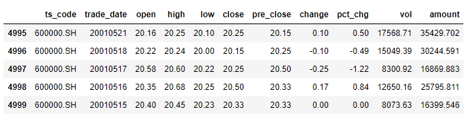

```python
#将数据列表中的第0列'date'设置为索引
sh.index=pd.to_datetime(sh.trade_date) 
#画出上证指数收盘价的走势
sh['close'].plot(figsize=(12,6))
plt.title('上证指数2001-2022年走势图')
plt.xlabel('日期')
plt.show()
```

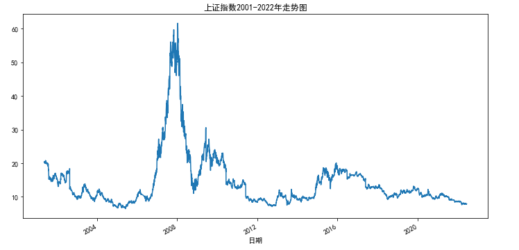

从指数走势图可以清晰看出，股指分别在2008年有一波大牛市，然后又从高峰跌入谷底，目前处于下跌通道。

## 3. 描述性统计

```python
#pandas的describe()函数提供了数据的描述性统计
#count:数据样本，mean:均值，std:标准差
sh.describe().round(2)
```

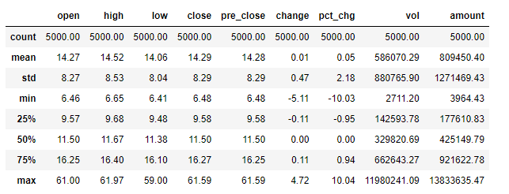

```python
#再查看下每日成交量 
#2012年以后交易量大
sh.loc[:"2012-01-01"]["vol"].plot(figsize=(20,10))
plt.title('上证指数2012-2022年日成交量图')
plt.xlabel('日期')
plt.show()
```

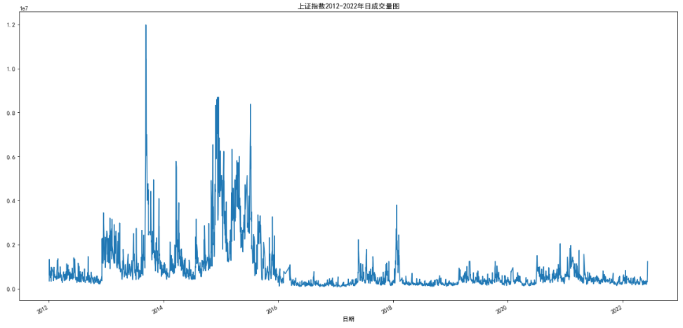

## 4. 均线分析

```python
#这里的平均线是通过自定义函数，手动设置20,52,252日均线
#移动平均线：
ma_day = [20,52,252]

for ma in ma_day:
    column_name = "%s日均线" %(str(ma))
    sh[column_name] =sh["close"].rolling(ma).mean()
#sh.tail(3)
#画出2015年以来收盘价和均线图
sh.loc[:'2015-10-8'][["close","20日均线","52日均线","252日均线"]].plot(figsize=(12,6))
plt.title('2015-2022上证指数走势图')
plt.xlabel('日期')
plt.show()
```

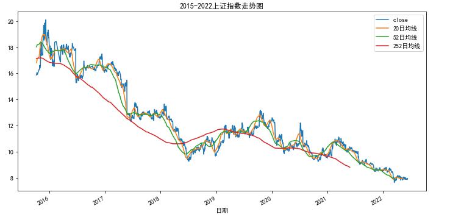

## 5. 日收益率可视化

```python
sh["日收益率"] = sh["close"].pct_change()
sh["日收益率"].loc[:'2010-01-01'].plot(figsize=(12,4))
plt.xlabel('日期')
plt.ylabel('收益率')
plt.title('2010-2022年上证指数日收益率')
plt.show()
```

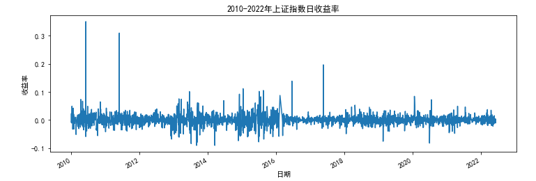

```python
###这里我们改变一下线条的类型
#(linestyle)以及加一些标记(marker)
sh["日收益率"].loc[:'2014-01-01'].plot(figsize=(12,4),linestyle="--",marker="o",color="g")
plt.title('2014-2022年日收益率图')
plt.xlabel('日期')
plt.show()
```

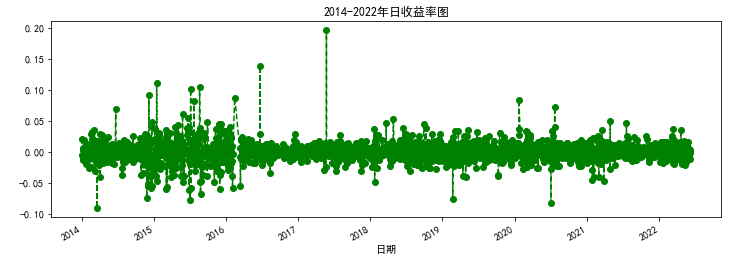

## 6. 分析多只股票指数

```python
#分析下常见的几个股票指数
stocks={'上证指数':'600438.SH','深证指数':'000001.SZ','深证30':'300014.SZ','上证60':'601012.SH'}

for stock in stocks.values():
    stock_index[stock]=ts.daily(ts_code=stock, start_date='2010-01-01')['close']
#stock_index.head()
#计算这些股票指数每日涨跌幅
tech_rets = stock_index.pct_change()[1:]
#tech_rets.head()
#收益率描述性统计
tech_rets.describe()
#结果不在此报告
#均值其实都大于0
tech_rets.mean()*100 #转换为%
```

```python
#jointplot这个函数可以画出两个指数的”相关性系数“，或者说皮尔森相关系数
sns.jointplot('601012.SH','300014.SZ',data=tech_rets)
```

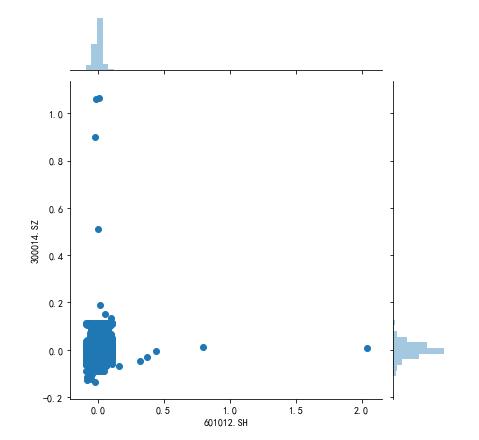

```python
#成对的比较不同数据集之间的相关性，
#而对角线则会显示该数据集的直方图
sns.pairplot(tech_rets.iloc[:,1:].dropna())
```

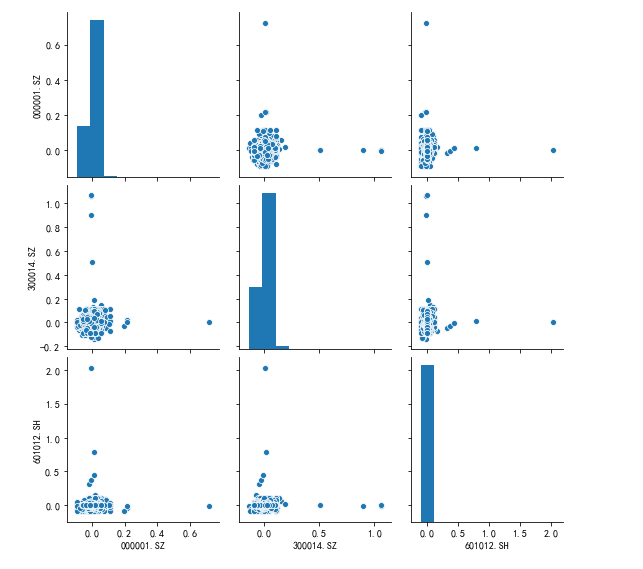

```python
returns_fig = sns.PairGrid(tech_rets.iloc[:,1:].dropna())
###右上角画散点图
returns_fig.map_upper(plt.scatter,color="purple") 
###左下角画核密度图 
returns_fig.map_lower(sns.kdeplot,cmap="cool_d") 
###对角线的直方图 
returns_fig.map_diag(plt.hist,bins=30)
```

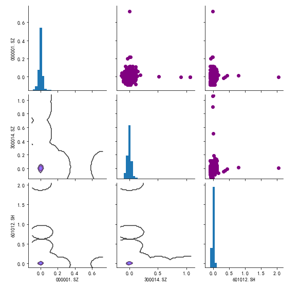

## 7. 收益率与风险

使用均值和标准分别刻画股票（指数）的收益率和波动率，对比分析不同股票（指数）的收益-风险情况。

```python
#构建一个计算股票收益率和标准差的函数
#默认起始时间为'2010-01-01'
def return_risk(stocks,startdate='2010-01-01'):
    close=pd.DataFrame()
    for stock in stocks.values():
        close[stock]=ts.daily(ts_code=stock, start_date=startdate)['close']
    tech_rets = close.pct_change()[1:]
    rets = tech_rets.dropna()
    ret_mean=rets.mean()*100
    ret_std=rets.std()*100
    return ret_mean,ret_std

#画图函数
def plot_return_risk():

    ret,vol=return_risk(stocks)
    color=np.array([ 0.18, 0.96, 0.75, 0.5])
    plt.scatter(ret, vol, marker = 'o', 
    c=color,s = 500,cmap=plt.get_cmap('Spectral'))
    plt.xlabel("日收益率均值%")     
    plt.ylabel("标准差%")
    for label,x,y in zip(stocks.keys(),ret,vol):
        plt.annotate(label,xy = (x,y),xytext = (20,20),
            textcoords = "offset points",
             ha = "right",va = "bottom",
            bbox = dict(boxstyle = 'round,pad=0.5',
            fc = 'yellow', alpha = 0.5),
                arrowprops = dict(arrowstyle = "->",
                    connectionstyle = "arc3,rad=0"))
stocks={'上证指数':'600438.SH','深证指数':'000001.SZ','深证30':'300014.SZ','上证60':'601012.SH'}
plot_return_risk()
```

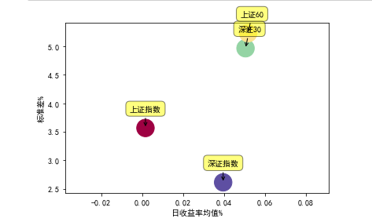

## 8. 蒙特卡洛模拟分析

蒙特卡洛模拟是一种统计学方法，用来模拟数据的演变趋势。蒙特卡洛模拟每次输入都随机选择输入值，通过大量的模拟，最终得出一个累计概率分布图。

```python
df=ts.daily(ts_code='600000.SH',start_date='20010515')
df.index=pd.to_datetime(df.trade_date)
tech_rets = df.close.pct_change()[1:]
rets = tech_rets.dropna()
#rets.head()
#下面的结果说明，我们95%的置信，一天我们不会损失超过0.03427.....
rets.quantile(0.05)

```

构建蒙特卡洛模拟函数：

```python
def monte_carlo(start_price,days,mu,sigma):
    dt=1/days
    price = np.zeros(days)
    price[0] = start_price
    shock = np.zeros(days)
    drift = np.zeros(days)

    for x in range(1,days):
        shock[x] = np.random.normal(loc=mu * dt,
                scale=sigma * np.sqrt(dt))
        drift[x] = mu * dt
        price[x] = price[x-1] + (price[x-1] *
                (drift[x] + shock[x]))
    return price
#模拟次数
runs = 10000
start_price = 2641.34 #今日收盘价
days = 252
mu=rets.mean()
sigma=rets.std()
simulations = np.zeros(runs)

for run in range(runs):
    simulations[run] = monte_carlo(start_price,
      days,mu,sigma)[days-1]
q = np.percentile(simulations,1)
plt.figure(figsize=(8,6))
plt.hist(simulations,bins=50,color='grey')
plt.figtext(0.6,0.8,s="初始价格: %.2f" % start_price)
plt.figtext(0.6,0.7,"预期价格均值: %.2f" %simulations.mean())
plt.figtext(0.15,0.6,"q(0.99: %.2f)" %q)
plt.axvline(x=q,linewidth=6,color="r")
plt.title("经过 %s 天后上证指数模拟价格分布图" %days,weight="bold")

```

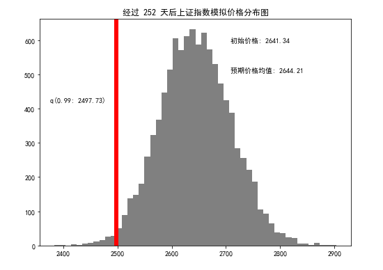

蒙特卡洛模拟在期权定价很有意义，使用期权定价里对未来股票走势的假定来进行蒙特卡洛模拟。

```python
import numpy as np
from time import time
np.random.seed(2018)
t0=time()
S0=2641.34
T=1.0; 
r=0.05; 
sigma=rets.std()
M=50;
dt=T/M; 
I=250000
S=np.zeros((M+1,I))
S[0]=S0
for t in range(1,M+1):
    z=np.random.standard_normal(I)
    S[t]=S[t-1]*np.exp((r-0.5*sigma**2)*dt+
          sigma*np.sqrt(dt)*z)
s_m=np.sum(S[-1])/I
tnp1=time()-t0
print('经过250000次模拟，得出1年以后上证指数的 预期平均收盘价为：%.2f'%s_m)

%matplotlib inline
import matplotlib.pyplot as plt
plt.figure(figsize=(10,6))
plt.plot(S[:,:10])
plt.grid(True)
plt.title('上证指数蒙特卡洛模拟其中10条模拟路径图')
plt.xlabel('时间')
plt.ylabel('指数')
plt.show()
```

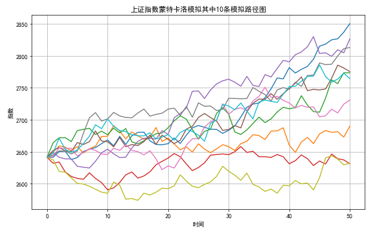

```python
plt.figure(figsize=(10,6))
plt.hist(S[-1], bins=120)
plt.grid(True)
plt.xlabel('指数水平')
plt.ylabel('频率')
plt.title('上证指数蒙特卡洛模拟')
```

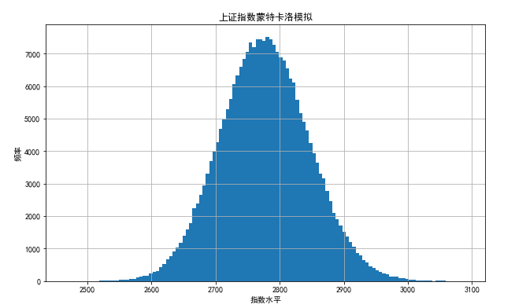
