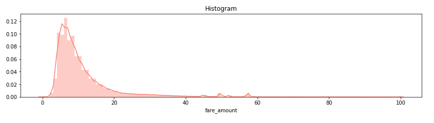

# 车费预测

- [1. 加载数据集](#1-加载数据集)
- [2. 数据分析、清洗](#2-数据分析清洗)
- [3. 检查数据中是否有空值](#3-检查数据中是否有空值)
- [4. 检查车费fare_amount这一列](#4-检查车费fare_amount这一列)
- [5. 检查乘客passenger_count这一列](#5-检查乘客passenger_count这一列)
- [6. 检查上车点的经度和纬度](#6-检查上车点的经度和纬度)
- [7. 检查下车点的经度和纬度](#7-检查下车点的经度和纬度)
- [8. 可视化地图，清理一些离异值](#8-可视化地图清理一些离异值)
- [9. 检查数据类型](#9-检查数据类型)
- [10. 日期数据进行分析](#10-日期数据进行分析)
- [11. 根据经纬度计算距离](#11-根据经纬度计算距离)
- [12. 每公里车费：根据距离、车费，计算每公里的车费](#12-每公里车费根据距离车费计算每公里的车费)
- [13. 模型训练和数据预测](#13-模型训练和数据预测)

## 1. 加载数据集

```python
import numpy as np
import pandas as pd
import matplotlib.pyplot as plt
import seaborn as sns
import sklearn
train = pd.read_csv(r'E:\学习\出租车车费预测\train.csv', nrows=1000000) # 加载训练集
test = pd.read_csv(r'E:\学习\出租车车费预测\test.csv') # 加载测试集
```

## 2. 数据分析、清洗

```python
train.head() # 默认显示前5行训练集数据
```


```python
test.head() # 默认显示前5行测试集数据
```


## 3. 检查数据中是否有空值

```python
train.isnull().sum().sort_values(ascending=True) # 统计空值的数量，根据数量大小排序
```

   key                   0
    fare_amount           0
    pickup_datetime       0
    pickup_longitude      0
    pickup_latitude       0
    passenger_count       0
    dropoff_longitude    10
    dropoff_latitude     10
    dtype: int64

```python
test.isnull().sum().sort_values(ascending=True) # 统计空值的数量，根据数量大小排序
```

   key                  0
    pickup_datetime      0
    pickup_longitude     0
    pickup_latitude      0
    dropoff_longitude    0
    dropoff_latitude     0
    passenger_count      0
    dtype: int64

```python
# 删除掉train中为空的数据(10行)
train.drop(train[train.isnull().any(1)].index, axis=0, inplace=True)
train.shape # 比原始数据少了10行
```

   (999990, 8)

## 4. 检查车费fare_amount这一列

```python
# 查看车费这列数据（车费不可能为负数）
train['fare_amount'].describe()
```

   count    999990.000000
    mean         11.347953
    std           9.821790
    min         -44.900000
    25%           6.000000
    50%           8.500000
    75%          12.500000
    max         500.000000
    Name: fare_amount, dtype: float64

```python
# 统计train中车费小于0的数据有多少
from collections import Counter
Counter(train['fare_amount']<0) # 有38行数据，车费小于0
```

   Counter({False: 999952, True: 38})

```python
# 删除掉车费小于0的数据
train.drop(train[train['fare_amount']<0].index, axis=0, inplace=True)
train['fare_amount'].describe() # 查看车费数据
```

   count    999952.000000
    mean         11.348616
    std           9.821249
    min           0.000000
    25%           6.000000
    50%           8.500000
    75%          12.500000
    max         500.000000
    Name: fare_amount, dtype: float64

```python
# 可视化（直方图）：0 < 票价 < 100
plt.figure(figsize=(14, 3))
plt.xlabel('fare $USD')
plt.title("Histogram")
fare = train[train.fare_amount<100].fare_amount
sns.distplot(fare,color="salmon",bins=100)
```



## 5. 检查乘客passenger_count这一列

```python
# 检查乘客列的数据
train['passenger_count'].describe()
```

   count    999952.000000
    mean          1.684942
    std           1.323908
    min           0.000000
    25%           1.000000
    50%           1.000000
    75%           2.000000
    max         208.000000
    Name: passenger_count, dtype: float64

```python
# 删除掉乘客人数大于6的数据
train.drop(train[train['passenger_count']>6].index, axis=0, inplace=True)
```

## 6. 检查上车点的经度和纬度

1. 纬度范围：-90 ~ 90
2. 经度范围：-180 ~ 180

```python
train['pickup_latitude'].describe() # 查看上车点纬度数据（min和max的值异常）

# 纬度小于-90的数据 ( 有3行 )
train[train['pickup_latitude']<-90]

# 经度大于90的数据 (有9行)
train[train['pickup_latitude']>90]

# 删除掉这些离异值数据

train.drop(train[(train['pickup_latitude']<-90) | (train['pickup_latitude']>90)].index, axis=0, inplace=True)
```

```python
# 查看上车点经度数据（min的值异常）
train['pickup_longitude'].describe()

# 查看经度小于-180的数据

train[train['pickup_longitude']<-180]

# 删除掉这些离异值

train.drop(train[train['pickup_longitude']<-180].index, axis=0, inplace=True)
```

## 7. 检查下车点的经度和纬度

```python
# 删除掉那些纬度小于-90，大于90的数据

train.drop(train[(train['dropoff_latitude']<-90) | (train['dropoff_latitude']>90)].index, axis=0, inplace=True)

# 删除掉那些经度小于-180， 大于180的数据

train.drop(train[(train['dropoff_longitude']<-180) | (train['dropoff_longitude']>180)].index, axis=0, inplace=True)
```

## 8. 可视化地图，清理一些离异值

```python
# 1 在test数据集上确定一个区域框，删除掉train数据集中不在区域框内的奇异点

# (1) 纬度最小值，纬度最大值
min(test.pickup_latitude.min(), test.dropoff_latitude.min()), \
max(test.pickup_latitude.max(), test.dropoff_latitude.max())

# （2）经度最小值，经度最大值
min(test.pickup_longitude.min(), test.dropoff_longitude.min()), \
max(test.pickup_longitude.max(), test.dropoff_longitude.max())

# (3) 根据指定的区域框，除掉那些奇异点

def select_within_boundingbox(df, BB): 
    return (df.pickup_longitude >= BB[0]) & (df.pickup_longitude <= BB[1]) & \
           (df.pickup_latitude >= BB[2]) & (df.pickup_latitude <= BB[3]) & \
           (df.dropoff_longitude >= BB[0]) & (df.dropoff_longitude <= BB[1]) & \
           (df.dropoff_latitude >= BB[2]) & (df.dropoff_latitude <= BB[3])

BB = (-74.5, -72.8, 40.5, 41.8)
# 截图
nyc_map = plt.imread('https://aiblog.nl/download/nyc_-74.5_-72.8_40.5_41.8.png')
BB_zoom = (-74.3, -73.7, 40.5, 40.9) # 放大后的地图
# 截图（放大）
nyc_map_zoom = plt.imread('https://aiblog.nl/download/nyc_-74.3_-73.7_40.5_40.9.png')

train = train[select_within_boundingbox(train, BB)] # 删除区域框之外的点

# （4）在地图显示这些点

def plot_on_map(df, BB, nyc_map, s=10, alpha=0.2):
    fig, axs = plt.subplots(1, 2, figsize=(16,10))
    # 第一个子图
    axs[0].scatter(df.pickup_longitude, df.pickup_latitude, alpha=alpha, c='r', s=s)
    axs[0].set_xlim(BB[0], BB[1])
    axs[0].set_ylim(BB[2], BB[3])
    axs[0].set_title('PickUp Locations')
    axs[0].imshow(nyc_map, extent=BB)
    
    # 第二个子图
    axs[1].scatter(df.dropoff_longitude, df.dropoff_latitude, alpha=alpha, c='r', s=s)
    axs[1].set_xlim((BB[0], BB[1]))
    axs[1].set_ylim((BB[2], BB[3]))
    axs[1].set_title('Dropoff locations')
    axs[1].imshow(nyc_map, extent=BB)
```

```python
plot_on_map(train, BB, nyc_map, s=1, alpha=0.3)
```


```python
plot_on_map(train, BB_zoom, nyc_map_zoom, s=1, alpha=0.3)
```


## 9. 检查数据类型

```python
train.dtypes
# 日期类型转换：key, pickup_datetime

for dataset in [train, test]:
    dataset['key'] = pd.to_datetime(dataset['key'])
    dataset['pickup_datetime'] = pd.to_datetime(dataset['pickup_datetime'])
```

## 10. 日期数据进行分析

将日期分隔为：

1. year
2. month
3. day
4. hour
5. day of week

```python
# 增加5列，分别是：year, month, day, hour, day of week

for dataset in [train, test]:
    dataset['year'] = dataset['pickup_datetime'].dt.year
    dataset['month'] = dataset['pickup_datetime'].dt.month
    dataset['day'] = dataset['pickup_datetime'].dt.day
    dataset['hour'] = dataset['pickup_datetime'].dt.hour
    dataset['day of week'] = dataset['pickup_datetime'].dt.dayofweek
```

## 11. 根据经纬度计算距离

```python
# 计算公式

def distance(lat1, long1, lat2, long2):
    data = [train, test]
    for i in data:
        R = 6371  # 地球半径（单位：千米）
        phi1 = np.radians(i[lat1])
        phi2 = np.radians(i[lat2])
    
        delta_phi = np.radians(i[lat2]-i[lat1])
        delta_lambda = np.radians(i[long2]-i[long1])
    
        #a = sin²((φB - φA)/2) + cos φA . cos φB . sin²((λB - λA)/2)
        a = np.sin(delta_phi / 2.0) ** 2 + np.cos(phi1) * np.cos(phi2) * np.sin(delta_lambda / 2.0) ** 2
    
        #c = 2 * atan2( √a, √(1−a) )
        c = 2 * np.arctan2(np.sqrt(a), np.sqrt(1-a))
    
        #d = R*c
        d = (R * c) # 单位：千米
        i['H_Distance'] = d
    return d

distance('pickup_latitude','pickup_longitude','dropoff_latitude','dropoff_longitude')

# 统计距离为0，票价为0的数据
train[(train['H_Distance']==0) & (train['fare_amount']==0)]
# 删除
train.drop(train[(train['H_Distance']==0) & (train['fare_amount']==0)].index, axis=0, inplace=True)


# 统计距离为0，票价不为0的数据
# 原因1：司机等待乘客很长时间，乘客最终取消了订单，乘客依然支付了等待的费用；
# 原因2：车辆的经纬度没有被准确录入或缺失；

len(train[(train['H_Distance']==0) & (train['fare_amount']!=0)])
train.drop(train[(train['H_Distance']==0) & (train['fare_amount']!=0)].index, axis=0, inplace=True)
```

## 12. 每公里车费：根据距离、车费，计算每公里的车费

```python
train['fare_per_mile'] = train.fare_amount / train.H_Distance
# 统计每一年的不同时间段的每小时车费
train.pivot_table('fare_per_mile', index='hour', columns='year').plot(figsize=(14, 6))
plt.ylabel('Fare $USD/mile')
```


## 13. 模型训练和数据预测

```python
X_train = train.iloc[:, [3,4,5,6,7,8,9,10,11,12,13]]
y_train = train.iloc[:, [1]] # are_amount 车费

# 随机森林实现
from sklearn.ensemble import RandomForestRegressor
rf = RandomForestRegressor()
rf.fit(X_train, y_train)

rf_predict = rf.predict(test.iloc[:, [2,3,4,5,6,7,8,9,10,11,12]])
```
